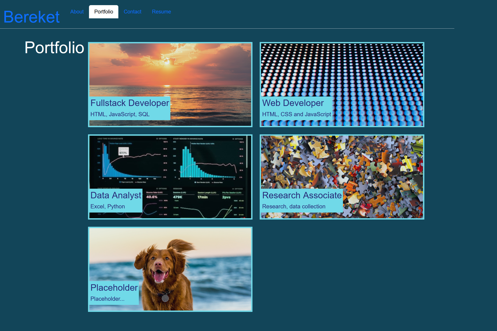

# Bereket's Portfolio  

## Description 

- Result-driven Software Engineer with more than 10 years track record of high performance in modular and object-oriented programming.
- Extensive experience developing Web-Based Applications, Frontend & Backend Design & Development, Implementation & maintenance, Unit Testing, Data mining and Analysis.
- Expertise in Web development using Python, Django (or other MVC frameworks), JavaScript/jQuery, CSS, front-end JS Frameworks (ReactJS) and HTML.
- Very conscientious and reliable with strong working knowledge of algorithms, data structures, troubleshooting and analytical and problem-solving skills.

## Table of Contents

- [Title](#title)
- [Description](#description)
- [Installation Instructions](#installation-instructions)
- [Usage Information](#usage)
- [Contribution Guidelines](#contribution)
- [Test Instructions](#test-instructions)
- [GitHub Username](#github-username)
- [Can be reached at](#email)
- [Laguages](#languages)
- [License](#license)
- [License Link](#license-link)
- [License Section](#license-section)
- [License Badge](#license-badge)
- [Link to the Site](#site-link)
- [APP Screenshot](#app-screenshot)

## Installation Instructions 

npm install --save

## Usage Information 

GIVEN a single-page application portfolio for a web developer
WHEN I load the portfolio
THEN I am presented with a page containing a header, a section for content, and a footer
WHEN I view the header
THEN I am presented with the developer's name and navigation with titles corresponding to different sections of the portfolio
WHEN I view the navigation titles
THEN I am presented with the titles About Me, Portfolio, Contact, and Resume, and the title corresponding to the current section is highlighted
WHEN I click on a navigation title
THEN I am presented with the corresponding section below the navigation without the page reloading and that title is highlighted
WHEN I load the portfolio the first time
THEN the About Me title and section are selected by default
WHEN I am presented with the About Me section
THEN I see a recent photo or avatar of the developer and a short bio about them
WHEN I am presented with the Portfolio section
THEN I see titled images of six of the developer’s applications with links to both the deployed applications and the corresponding GitHub repository
WHEN I am presented with the Contact section
THEN I see a contact form with fields for a name, an email address, and a message
WHEN I move my cursor out of one of the form fields without entering text
THEN I receive a notification that this field is required
WHEN I enter text into the email address field
THEN I receive a notification if I have entered an invalid email address
WHEN I am presented with the Resume section
THEN I see a link to a downloadable resume and a list of the developer’s proficiencies
WHEN I view the footer
THEN I am presented with text or icon links to the developer’s GitHub and LinkedIn profiles, and their profile on a third platform (Stack Overflow, Twitter)

## Contribution Guidelines 

N/A

## Test Instructions 

N/A

## Questions 

https://github.com/bereto2008

### How to reach me with additonal questions: 

bereto2008@gmail.com

## Laguages 

HTML, CSS, JavaScript, and react

## License 

The MIT License

## License Link 

https://opensource.org/licenses/MIT

Please refere to github The MIT License license or to click the link above

## Link to the Deployed APP 

https://bespoke-capybara-7e98b6.netlify.app/

## APP Screenshot 

